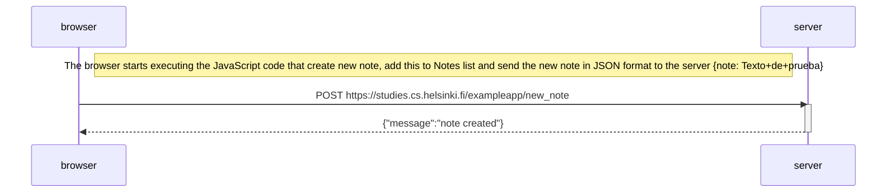

## usuario crea una nueva nota en la página https://studies.cs.helsinki.fi/exampleapp/spa

```mermaid
sequenceDiagram
    participant browser
    participant server
    Note right of browser: The browser starts executing the JavaScript code that create new note, add this to Notes list and send the new note in JSON format to the server {note: Texto+de+prueba}
    browser->>server: POST https://studies.cs.helsinki.fi/exampleapp/new_note
    activate server
    server-->>browser: {"message":"note created"}
    deactivate server
```

